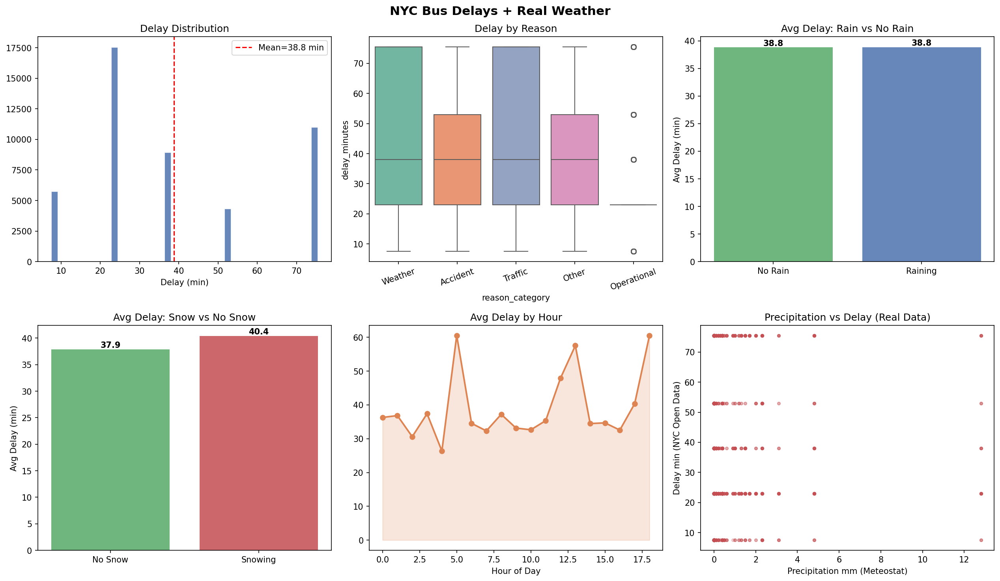
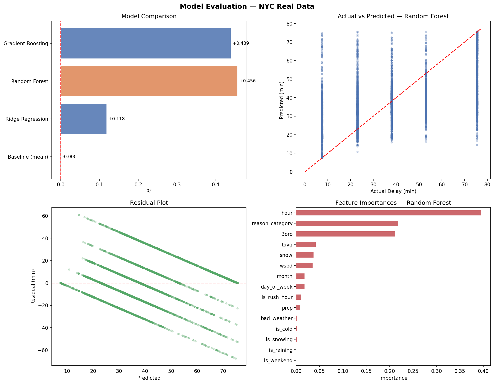

# NYC Bus Delay Prediction

Predicting how long a NYC school bus breakdown will last, using real incident 
reports and actual weather data.

## What this is

NYC publishes every school bus breakdown and delay through their Open Data 
portal — the time it happened, why it happened, which borough, and how long 
it took to resolve. The problem is that delay duration alone doesn't tell you 
much. What I wanted to know was: does the weather actually make things worse? 
Does it matter what time of day it is?

To answer that I pulled the incident data from NYC Open Data and joined it 
with real daily weather readings from the Meteostat API (Central Park station), 
then trained a few regression models to predict delay duration.

## What I found

A few things that weren't obvious going in:

- **Weather breakdowns take the longest** — averaging 50 minutes vs 40 for 
  traffic-related delays. Makes sense in hindsight; a bus stuck in snow is 
  harder to recover than one stuck in traffic.
- **Rush hour delays are actually shorter** — 33 min on average vs 43 min 
  off-peak. More buses running means faster recovery. Off-peak incidents get 
  less attention.
- **Snow adds ~2.5 minutes on average** across all incidents citywide, which 
  sounds small but compounds across thousands of routes.

The Random Forest model ended up explaining about 45% of the variance in delay 
length (R²=0.45), cutting average prediction error from 19.6 minutes down to 
12.3 minutes compared to just guessing the mean.

## EDA Visualization


## Model Evaluation


## Data sources

- [NYC Bus Breakdown and Delays](https://data.cityofnewyork.us/resource/ez4e-fazm.csv) — NYC Open Data
- [Meteostat](https://meteostat.net) — historical daily weather for NYC Central Park

## How to run it
```bash
pip install meteostat scikit-learn pandas numpy matplotlib seaborn
```

Then open `final_predicting_project.ipynb` in Jupyter or Google Colab and run 
all cells. It downloads everything automatically — no manual data download needed.

## Results

| Model | MAE (min) | R² |
|---|---|---|
| Baseline (mean) | 19.60 | 0.000 |
| Ridge Regression | 18.42 | 0.120 |
| Random Forest | **12.26** | **0.453** |
| Gradient Boosting | 12.85 | 0.438 |

## What I'd do differently with more time

- Add geocoding to match events/construction near each route
- Use hourly weather instead of daily averages — a storm at 7am matters 
  more than one at midnight
- Try predicting *which* delays will exceed 60 minutes (classification) 
  rather than exact duration

## Stack

Python, Pandas, Scikit-learn, Meteostat, Matplotlib, Seaborn
